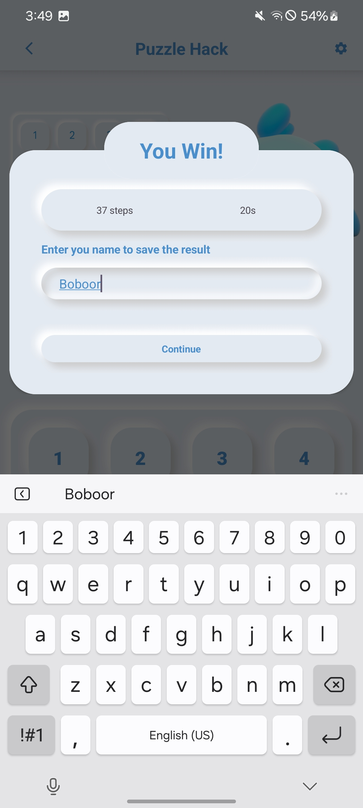
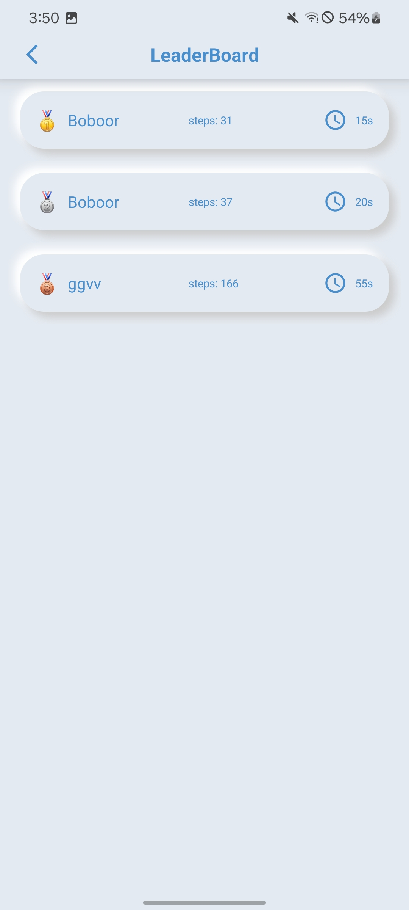
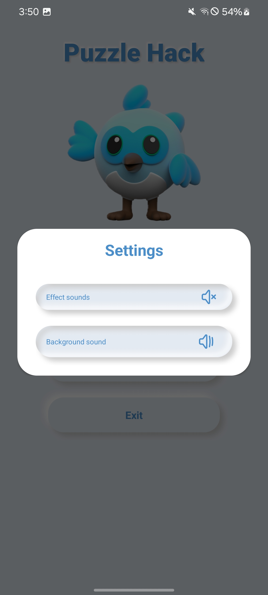

# 🧩 Puzzle Hack (Puzzle 15)

A **15-puzzle game** built with modern design, animations, and sound effects. The game features a responsive UI with **day/night themes** and celebratory confetti on wins.

## 🚀 Features
- **ConstraintLayout** for adaptive UI  
- **Neumorphic UI** for sleek visuals  
- **SharedPreferences** to save game state  
- **Navigation Components** for screen transitions  
- **MediaPlayer** for sound effects and background music  
- **Konfetti library** for particle animations  
- **Day/Night theme** support  

## 📸 Screenshots
<p align="center">
  
  
  
  
  
  
</p>

## 🛠️ Technologies Used
- **Kotlin** + **Jetpack Compose**  
- **Animations** for smooth interactions  
- **MediaPlayer** for audio management  
- **SharedPreferences** for data storage  
- **Navigation Components** for seamless user flow  

## 📥 Installation
1. Download and install apk file
   ```bash
   https://github.com/BoburjonMurodov/PuzzleHack/blob/main/app-debug.apk
